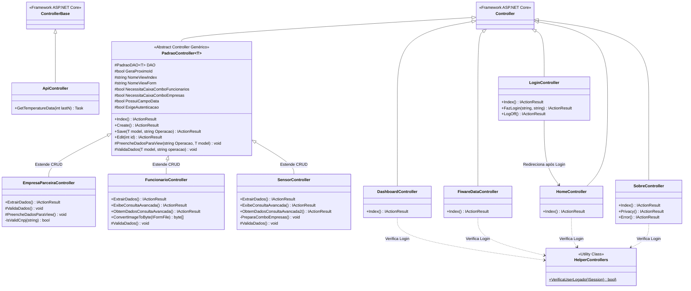

```mermaid
classDiagram
    %% ==========================================
    %% CLASSES BASE / ESTRUTURAIS
    %% ==========================================
    class Controller {
        <<Framework ASP.NET Core>>
    }

    class ControllerBase {
        <<Framework ASP.NET Core>>
    }

    class PadraoController~T~ {
        <<Abstract Controller Genérico>>
        #PadraoDAO~T~ DAO
        #bool GeraProximoId
        #string NomeViewIndex
        #string NomeViewForm
        #bool NecessitaCaixaComboFuncionarios
        #bool NecessitaCaixaComboEmpresas
        #bool PossuiCampoData
        #bool ExigeAutenticacao
        +Index() IActionResult
        +Create() IActionResult
        +Save(T model, string Operacao) IActionResult
        +Edit(int id) IActionResult
        #PreencheDadosParaView(string Operacao, T model) void
        #ValidaDados(T model, string operacao) void
    }

    %% ==========================================
    %% CONTROLADORES DO SISTEMA (AÇÕES E FLUXOS)
    %% ==========================================
    class EmpresaParceiraController {
        +ExtrairDados() IActionResult
        #ValidaDados() void
        #PreencheDadosParaView() void
        -IsValidCnpj(string) bool
    }

    class FuncionarioController {
        +ExtrairDados() IActionResult
        +ExibeConsultaAvancada() IActionResult
        +ObtemDadosConsultaAvancada() IActionResult
        +ConvertImageToByte(IFormFile) byte[]
        #ValidaDados() void
    }

    class SensorController {
        +ExtrairDados() IActionResult
        +ExibeConsultaAvancada() IActionResult
        +ObtemDadosConsultaAvancada2() IActionResult
        -PreparaComboEmpresas() void
        #ValidaDados() void
    }

    class DashboardController {
        +Index() IActionResult
    }

    class FiwareDataController {
        +Index() IActionResult
    }

    class LoginController {
        +Index() IActionResult
        +FazLogin(string, string) IActionResult
        +LogOff() IActionResult
    }

    class HomeController {
        +Index() IActionResult
    }

    class SobreController {
        +Index() IActionResult
        +Privacy() IActionResult
        +Error() IActionResult
    }

    class ApiController {
        +GetTemperatureData(int lastN) Task
    }

    class HelperControllers {
        <<Utility Class>>
        +VerificaUserLogado(ISession) bool\$
    }

    %% ==========================================
    %% RELACIONAMENTOS E HERANÇAS
    %% ==========================================
    
    %% Herança do Framework
    Controller <|-- PadraoController~T~
    Controller <|-- DashboardController
    Controller <|-- FiwareDataController
    Controller <|-- LoginController
    Controller <|-- HomeController
    Controller <|-- SobreController
    ControllerBase <|-- ApiController

    %% Herança Genérica da Arquitetura
    PadraoController~EmpresaParceiraViewModel~ <|-- EmpresaParceiraController : Estende CRUD
    PadraoController~FuncionarioViewModel~ <|-- FuncionarioController : Estende CRUD
    PadraoController~SensorViewModel~ <|-- SensorController : Estende CRUD

    %% Dependências de Segurança e Sessão
    HomeController ..> HelperControllers : Verifica Login
    SobreController ..> HelperControllers : Verifica Login
    DashboardController ..> HelperControllers : Verifica Login
    FiwareDataController ..> HelperControllers : Verifica Login
    LoginController --> HomeController : Redireciona após Login
```
