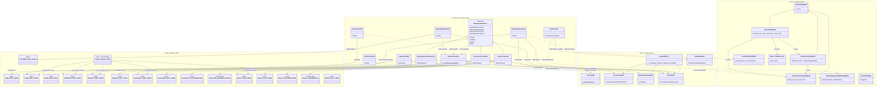

```mermaid
classDiagram
    %% =========================================================================
    %% CAMADA DE VIEWS (Interface com o Usuário - Conforme a Árvore de Arquivos)
    %% =========================================================================
    namespace Views_Camada_Visual {
        class Login_Index_cshtml { <<View>> }
        class Home_Index_cshtml { <<View>> }
        class Sobre_Index_cshtml { <<View>> }
        class Dashboard_Index_cshtml { <<View>> }
        class Empresa_Index_cshtml { <<View>> }
        class Empresa_Form_cshtml { <<View>> }
        class Funcionario_Index_cshtml { <<View>> }
        class Funcionario_Form_cshtml { <<View>> }
        class Funcionario_ConsultaAvancada { <<View>> }
        class Funcionario_pvGridFuncionarios { <<Partial View>> }
        class Sensor_Index_cshtml { <<View>> }
        class Sensor_Form_cshtml { <<View>> }
        class Sensor_ConsultaAvancada { <<View>> }
        class Sensor_pvGridSensores { <<Partial View>> }
        class FiwareData_Index_cshtml { <<View>> }
        class Shared_Layout_cshtml { <<View - Layout Base>> }
        class Shared_Error_cshtml { <<View>> }
    }

    %% =========================================================================
    %% CAMADA DE CONTROLLERS (Fluxo de Navegação, Validação e Regras)
    %% =========================================================================
    namespace Controllers_Camada_Logica {
        class PadraoController~T~ {
            <<Abstract>>
            #PadraoDAO~T~ DAO
            #string NomeViewIndex
            #string NomeViewForm
            #bool ExigeAutenticacao
            +Index()
            +Create()
            +Save()
            +Edit()
        }
        class LoginController { +FazLogin() }
        class HomeController { +Index() }
        class SobreController { +Index() }
        class DashboardController { +Index() }
        class EmpresaParceiraController { +ExtrairDados() }
        class FuncionarioController { +ExtrairDados() }
        class SensorController { +ExtrairDados() }
        class FiwareDataController { +Index() }
        class ApiController { +GetTemperatureData() }
        class HelperControllers { <<Utility>> +VerificaUserLogado()\$ }
    }

    %% =========================================================================
    %% CAMADA DE DAOs / PERSISTÊNCIA (Acesso ao Banco de Dados)
    %% =========================================================================
    namespace DAOs_Camada_Banco {
        class PadraoDAO~T~ { <<Abstract>> +Listagem() +Insert() +Update() +Consulta() }
        class ConexaoDB { <<Utility>> +GetConexao()\$ }
        class FuncionarioDAO { +ConsultaAvancadaFuncionarios() }
        class EmpresaParceiraDAO { +Listagem() }
        class SensorDAO { +ConsultaAvancadaSensores() }
        class FiwareDataDAO { +GetTemperatureDataAsync() }
    }

    %% =========================================================================
    %% CAMADA DE MODELS (Dados e Entidades do Sistema)
    %% =========================================================================
    namespace Models_Camada_Dados {
        class PadraoViewModel { <<Abstract>> +int id }
        class EmpresaParceiraViewModel { +string nm_empr; +int id_func }
        class FuncionarioViewModel { +string login_func; +byte[] ImagemEmByte }
        class SensorViewModel { +string ds_tipo_sens; +int id_func; +int id_empr }
        class DashboardViewModel { +List Sensores; +List Funcionarios }
        class FiwareTemperatureDataViewModel { +string RecvTime; +float AttrValue }
        class ErrorViewModel { +string Erro }
        class Motor_TabelaExterna { +int cd_motor }
    }

    %% =========================================================================
    %% LINKAGENS E RELACIONAMENTOS ARQUITETURAIS (O Fluxo do Sistema)
    %% =========================================================================
    
    %% Heranças da Infraestrutura Genérica (.NET Avançado)
    PadraoController~FuncionarioViewModel~ <|-- FuncionarioController
    PadraoController~EmpresaParceiraViewModel~ <|-- EmpresaParceiraController
    PadraoController~SensorViewModel~ <|-- SensorController
    PadraoDAO~FuncionarioViewModel~ <|-- FuncionarioDAO
    PadraoDAO~EmpresaParceiraViewModel~ <|-- EmpresaParceiraDAO
    PadraoDAO~SensorViewModel~ <|-- SensorDAO
    PadraoViewModel <|-- EmpresaParceiraViewModel
    PadraoViewModel <|-- FuncionarioViewModel
    PadraoViewModel <|-- SensorViewModel

    %% Relacionamentos do Banco de Dados (DER Embutido)
    FuncionarioViewModel "1" --> "1" EmpresaParceiraViewModel : id_func
    SensorViewModel "*" --> "1" FuncionarioViewModel : id_func
    SensorViewModel "*" --> "1" EmpresaParceiraViewModel : id_empr
    SensorViewModel "*" --> "1" Motor_TabelaExterna : cd_motor

    %% Interações das Telas (Views) chamando Controllers e recebendo Layout
    Shared_Layout_cshtml --> Home_Index_cshtml : Provê Casca Visual
    Shared_Layout_cshtml --> Dashboard_Index_cshtml : Provê Casca Visual
    Shared_Layout_cshtml --> Empresa_Index_cshtml : Provê Casca Visual
    Shared_Layout_cshtml --> Funcionario_Index_cshtml : Provê Casca Visual
    Shared_Layout_cshtml --> Sensor_Index_cshtml : Provê Casca Visual

    %% Interação Controller -> DAO -> View (Mecânica clássica MVC)
    LoginController --> ConexaoDB : Autentica via SQL
    LoginController --> Login_Index_cshtml : Carrega Tela
    
    HomeController ..> HelperControllers : Checa Sessão
    HomeController --> Home_Index_cshtml : Abre Tela

    DashboardController ..> HelperControllers : Checa Sessão
    DashboardController --> SensorDAO : Pede Dados
    DashboardController --> FuncionarioDAO : Pede Dados
    DashboardController ..> DashboardViewModel : Alimenta Pacote
    DashboardController --> Dashboard_Index_cshtml : Envia Pacote para Tela

    EmpresaParceiraController --> EmpresaParceiraDAO : Aciona CRUD
    EmpresaParceiraController --> Empresa_Index_cshtml : Renderiza Lista
    EmpresaParceiraController --> Empresa_Form_cshtml : Renderiza Form

    FuncionarioController --> FuncionarioDAO : Aciona CRUD/Buscas
    FuncionarioController --> Funcionario_Index_cshtml
    FuncionarioController --> Funcionario_Form_cshtml
    FuncionarioController --> Funcionario_ConsultaAvancada
    FuncionarioController --> Funcionario_pvGridFuncionarios

    SensorController --> SensorDAO : Aciona CRUD/Buscas
    SensorController --> Sensor_Index_cshtml
    SensorController --> Sensor_Form_cshtml
    SensorController --> Sensor_ConsultaAvancada
    SensorController --> Sensor_pvGridSensores

    FiwareDataController ..> HelperControllers : Checa Sessão
    FiwareDataController --> SensorDAO : Pede Lista
    FiwareDataController --> FiwareData_Index_cshtml : Exibe Gráficos

    ApiController --> FiwareDataDAO : Pede dados via JSON
    FiwareDataDAO ..> FiwareTemperatureDataViewModel : Converte Telemetria
    ApiController ..> FiwareTemperatureDataViewModel : Cospe JSON Bruto
```
