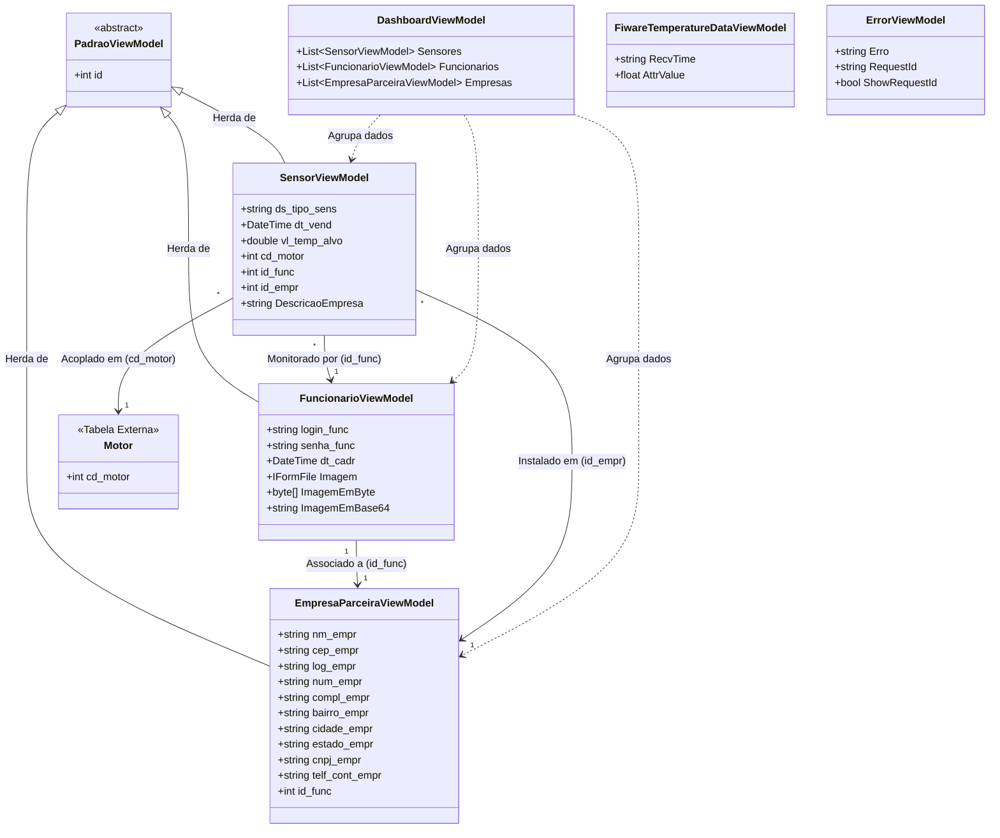

```mermaid
classDiagram
    %% ==========================================
    %% CLASSES BASE / ABSTRATAS
    %% ==========================================
    class PadraoViewModel {
        <<abstract>>
        +int id
    }

    %% ==========================================
    %% CLASSES MODEL (ENTIDADES DO BANCO)
    %% ==========================================
    class EmpresaParceiraViewModel {
        +string nm_empr
        +string cep_empr
        +string log_empr
        +string num_empr
        +string compl_empr
        +string bairro_empr
        +string cidade_empr
        +string estado_empr
        +string cnpj_empr
        +string telf_cont_empr
        +int id_func
    }

    class FuncionarioViewModel {
        +string login_func
        +string senha_func
        +DateTime dt_cadr
        +IFormFile Imagem
        +byte[] ImagemEmByte
        +string ImagemEmBase64
    }

    class SensorViewModel {
        +string ds_tipo_sens
        +DateTime dt_vend
        +double vl_temp_alvo
        +int cd_motor
        +int id_func
        +int id_empr
        +string DescricaoEmpresa
    }

    class Motor {
        <<Tabela Externa>>
        +int cd_motor
    }

    %% ==========================================
    %% MODELOS DE TELA / UTILITÁRIOS (Sem tabela direta)
    %% ==========================================
    class DashboardViewModel {
        +List~SensorViewModel~ Sensores
        +List~FuncionarioViewModel~ Funcionarios
        +List~EmpresaParceiraViewModel~ Empresas
    }

    class FiwareTemperatureDataViewModel {
        +string RecvTime
        +float AttrValue
    }

    class ErrorViewModel {
        +string Erro
        +string RequestId
        +bool ShowRequestId
    }

    %% ==========================================
    %% RELACIONAMENTOS E REGRAS DE NEGÓCIO
    %% ==========================================
    
    %% Relações de Herança (Orientação a Objetos)
    PadraoViewModel <|-- EmpresaParceiraViewModel : Herda de
    PadraoViewModel <|-- FuncionarioViewModel : Herda de
    PadraoViewModel <|-- SensorViewModel : Herda de

    %% Relações de Integridade (Banco de Dados / Chaves Estrangeiras)
    FuncionarioViewModel "1" --> "1" EmpresaParceiraViewModel : Associado a (id_func)
    SensorViewModel "*" --> "1" FuncionarioViewModel : Monitorado por (id_func)
    SensorViewModel "*" --> "1" EmpresaParceiraViewModel : Instalado em (id_empr)
    SensorViewModel "*" --> "1" Motor : Acoplado em (cd_motor)

    %% Composição Lógica do Dashboard de Tela
    DashboardViewModel ..> SensorViewModel : Agrupa dados
    DashboardViewModel ..> FuncionarioViewModel : Agrupa dados
    DashboardViewModel ..> EmpresaParceiraViewModel : Agrupa dados
```
