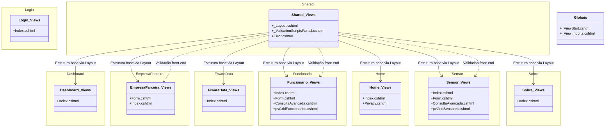

```mermaid
classDiagram
    %% ==========================================
    %% ARQUIVOS DE CONFIGURAÇÃO GLOBAL DAS VIEWS
    %% ==========================================
    class Globais {
        +_ViewStart.cshtml
        +_ViewImports.cshtml
    }

    %% ==========================================
    %% PASTAS E ARQUIVOS .CSHTML (Telas por Módulo)
    %% ==========================================
    namespace Dashboard {
        class Dashboard_Views {
            +Index.cshtml
        }
    }

    namespace EmpresaParceira {
        class EmpresaParceira_Views {
            +Form.cshtml
            +Index.cshtml
        }
    }

    namespace FiwareData {
        class FiwareData_Views {
            +Index.cshtml
        }
    }

    namespace Funcionario {
        class Funcionario_Views {
            +Index.cshtml
            +Form.cshtml
            +ConsultaAvancada.cshtml
            +pvGridFuncionarios.cshtml
        }
    }

    namespace Home {
        class Home_Views {
            +Index.cshtml
            +Privacy.cshtml
        }
    }

    namespace Login {
        class Login_Views {
            +Index.cshtml
        }
    }

    namespace Sensor {
        class Sensor_Views {
            +Index.cshtml
            +Form.cshtml
            +ConsultaAvancada.cshtml
            +pvGridSensores.cshtml
        }
    }

    namespace Sobre {
        class Sobre_Views {
            +Index.cshtml
        }
    }

    %% ==========================================
    %% PASTA SHARED (Componentes Compartilhados)
    %% ==========================================
    namespace Shared {
        class Shared_Views {
            +_Layout.cshtml
            +_ValidationScriptsPartial.cshtml
            +Error.cshtml
        }
    }

    %% ==========================================
    %% RELACIONAMENTOS E DEPENDÊNCIAS DAS VIEWS
    %% ==========================================
    
    Shared_Views --> Dashboard_Views : Estrutura base via Layout
    Shared_Views --> EmpresaParceira_Views : Estrutura base via Layout
    Shared_Views --> FiwareData_Views : Estrutura base via Layout
    Shared_Views --> Funcionario_Views : Estrutura base via Layout
    Shared_Views --> Home_Views : Estrutura base via Layout
    Shared_Views --> Sensor_Views : Estrutura base via Layout
    Shared_Views --> Sobre_Views : Estrutura base via Layout

    Shared_Views ..> EmpresaParceira_Views : Validação front-end
    Shared_Views ..> Funcionario_Views : Validação front-end
    Shared_Views ..> Sensor_Views : Validation front-end
```
