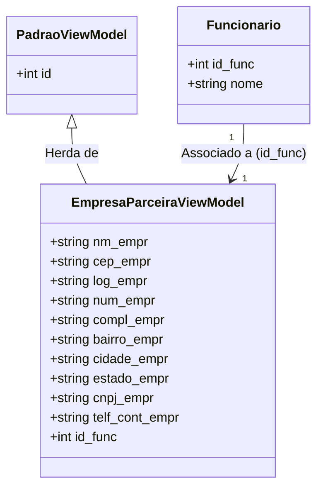
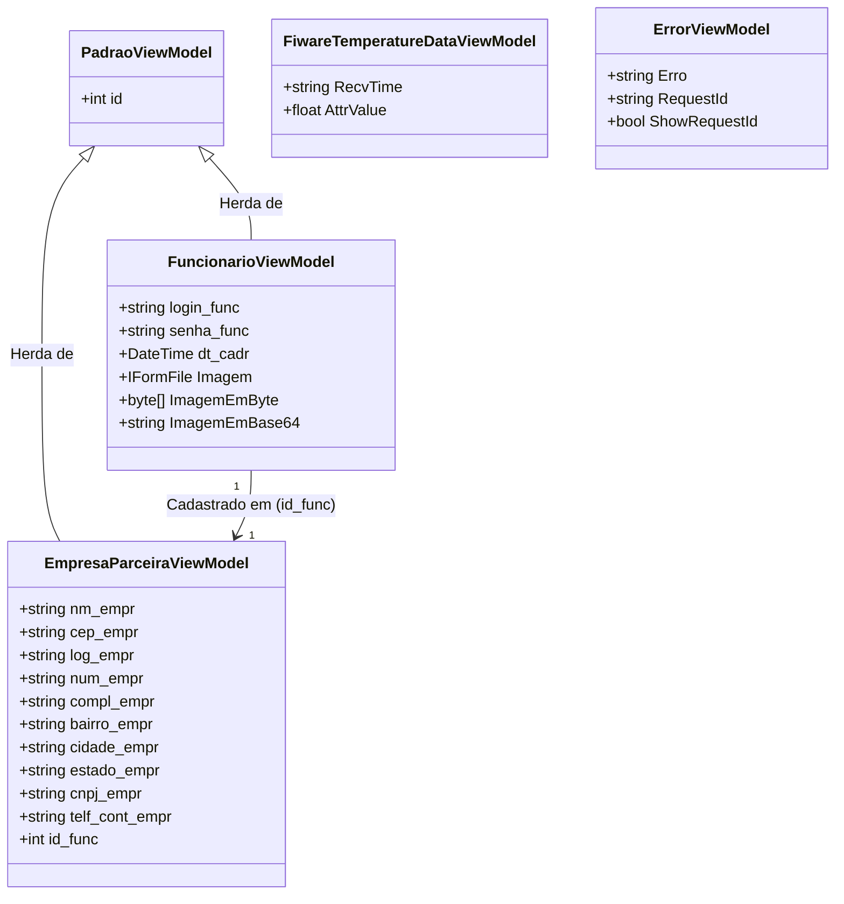
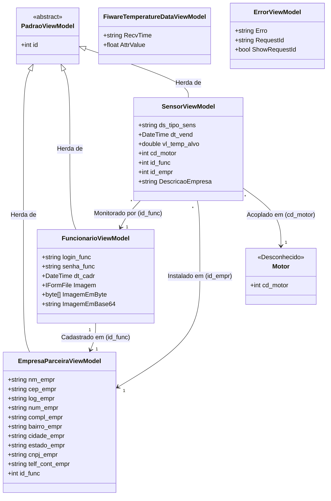
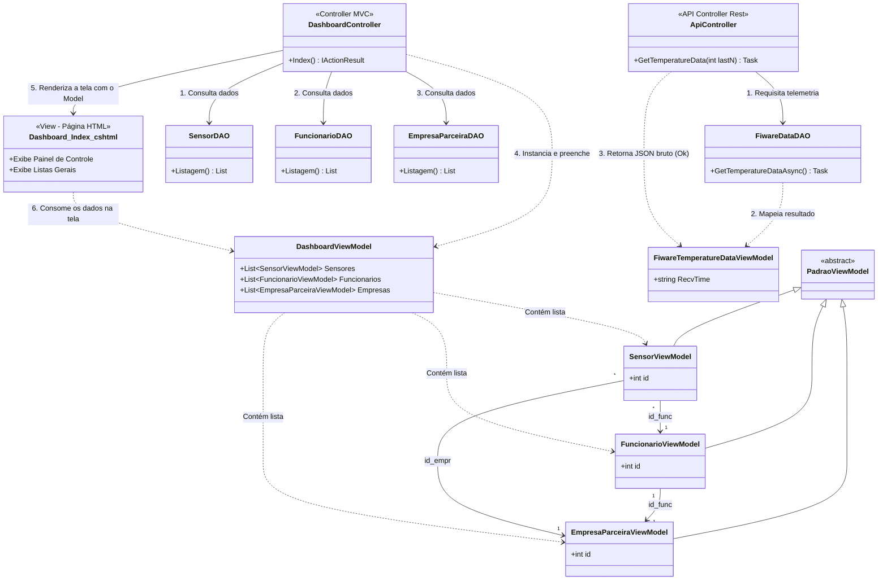
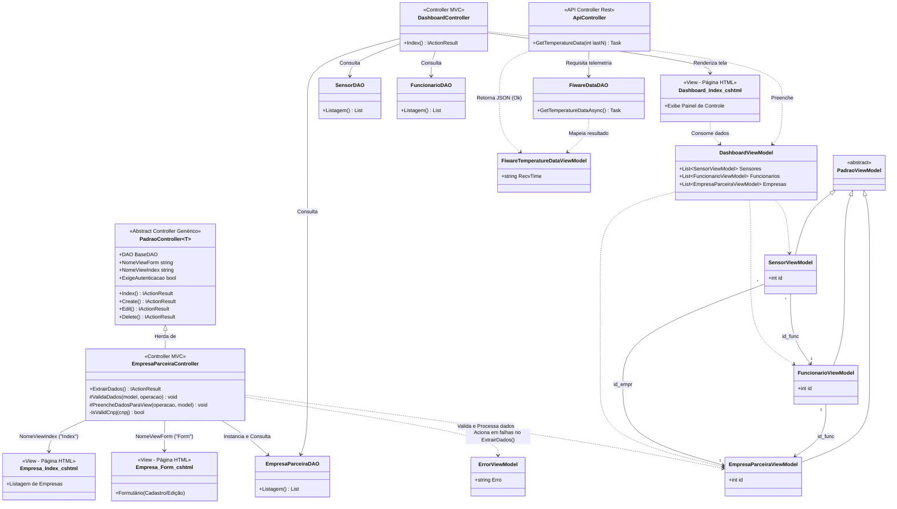

```mermaid
classDiagram
    PadraoViewModel <|-- EmpresaParceiraViewModel : Herda de
    Funcionario "1" --> "1" EmpresaParceiraViewModel : Associado a (id_func)

    class EmpresaParceiraViewModel {
        +string nm_empr
        +string cep_empr
        +string log_empr
        +string num_empr
        +string compl_empr
        +string bairro_empr
        +string cidade_empr
        +string estado_empr
        +string cnpj_empr
        +string telf_cont_empr
        +int id_func
    }

    class PadraoViewModel {
        +int id
    }

    class Funcionario {
        +int id_func
        +string nome
    }
```

```mermaid
classDiagram
    %% Relações de Herança
    PadraoViewModel <|-- EmpresaParceiraViewModel : Herda de
    PadraoViewModel <|-- FuncionarioViewModel : Herda de

    %% Relações de Associação (Banco de Dados)
    FuncionarioViewModel "1" --> "1" EmpresaParceiraViewModel : Cadastrado em (id_func)

    class PadraoViewModel {
        +int id
    }

    class EmpresaParceiraViewModel {
        +string nm_empr
        +string cep_empr
        +string log_empr
        +string num_empr
        +string compl_empr
        +string bairro_empr
        +string cidade_empr
        +string estado_empr
        +string cnpj_empr
        +string telf_cont_empr
        +int id_func
    }

    class FuncionarioViewModel {
        +string login_func
        +string senha_func
        +DateTime dt_cadr
        +IFormFile Imagem
        +byte[] ImagemEmByte
        +string ImagemEmBase64
    }

    class FiwareTemperatureDataViewModel {
        +string RecvTime
        +float AttrValue
    }

    class ErrorViewModel {
        +string Erro
        +string RequestId
        +bool ShowRequestId
    }
```

```mermaid
classDiagram
    %% Classes Abstratas
    class PadraoViewModel {
        <<abstract>>
        +int id
    }

    %% Relações de Herança (Quem herda de quem)
    PadraoViewModel <|-- EmpresaParceiraViewModel : Herda de
    PadraoViewModel <|-- FuncionarioViewModel : Herda de
    PadraoViewModel <|-- SensorViewModel : Herda de

    %% Relacionamentos do Banco de Dados / Negócio
    FuncionarioViewModel "1" --> "1" EmpresaParceiraViewModel : Cadastrado em (id_func)
    SensorViewModel "*" --> "1" FuncionarioViewModel : Monitorado por (id_func)
    SensorViewModel "*" --> "1" EmpresaParceiraViewModel : Instalado em (id_empr)
    SensorViewModel "*" --> "1" Motor : Acoplado em (cd_motor)

    class EmpresaParceiraViewModel {
        +string nm_empr
        +string cep_empr
        +string log_empr
        +string num_empr
        +string compl_empr
        +string bairro_empr
        +string cidade_empr
        +string estado_empr
        +string cnpj_empr
        +string telf_cont_empr
        +int id_func
    }

    class FuncionarioViewModel {
        +string login_func
        +string senha_func
        +DateTime dt_cadr
        +IFormFile Imagem
        +byte[] ImagemEmByte
        +string ImagemEmBase64
    }

    class SensorViewModel {
        +string ds_tipo_sens
        +DateTime dt_vend
        +double vl_temp_alvo
        +int cd_motor
        +int id_func
        +int id_empr
        +string DescricaoEmpresa
    }

    class Motor {
        <<Desconhecido>>
        +int cd_motor
    }

    class FiwareTemperatureDataViewModel {
        +string RecvTime
        +float AttrValue
    }

    class ErrorViewModel {
        +string Erro
        +string RequestId
        +bool ShowRequestId
    }
```

```mermaid
classDiagram
    %% ==========================================
    %% 1. CAMADA DE VIEWS (Telas do Usuário)
    %% ==========================================
    class Dashboard_Index_cshtml {
        <<View - Página HTML>>
        +Exibe Painel de Controle
        +Exibe Listas Gerais
    }

    %% ==========================================
    %% 2. CAMADA DE CONTROLLERS (Lógica de Fluxo)
    %% ==========================================
    class DashboardController {
        <<Controller MVC>>
        +Index() IActionResult
    }

    class ApiController {
        <<API Controller Rest>>
        +GetTemperatureData(int lastN) Task
    }

    %% ==========================================
    %% 3. CAMADA DE DAO (Acesso ao Banco de Dados)
    %% ==========================================
    class SensorDAO { +Listagem() List }
    class FuncionarioDAO { +Listagem() List }
    class EmpresaParceiraDAO { +Listagem() List }
    class FiwareDataDAO { +GetTemperatureDataAsync() Task }

    %% ==========================================
    %% 4. CAMADA DE MODELS (Estrutura de Dados)
    %% ==========================================
    class DashboardViewModel {
        +List~SensorViewModel~ Sensores
        +List~FuncionarioViewModel~ Funcionarios
        +List~EmpresaParceiraViewModel~ Empresas
    }
    class SensorViewModel { +int id }
    class FuncionarioViewModel { +int id }
    class EmpresaParceiraViewModel { +int id }
    class FiwareTemperatureDataViewModel { +string RecvTime }
    class PadraoViewModel { <<abstract>> }

    %% ==========================================
    %% RELACIONAMENTOS E FLUXOS DO MVC
    %% ==========================================
    
    %% Heranças dos Models
    PadraoViewModel <|-- EmpresaParceiraViewModel
    PadraoViewModel <|-- FuncionarioViewModel
    PadraoViewModel <|-- SensorViewModel

    %% Relações do Banco (Models)
    FuncionarioViewModel "1" --> "1" EmpresaParceiraViewModel : id_func
    SensorViewModel "*" --> "1" FuncionarioViewModel : id_func
    SensorViewModel "*" --> "1" EmpresaParceiraViewModel : id_empr

    %% Composição do Dashboard
    DashboardViewModel ..> SensorViewModel : Contém lista
    DashboardViewModel ..> FuncionarioViewModel : Contém lista
    DashboardViewModel ..> EmpresaParceiraViewModel : Contém lista

    %% Fluxo de Acesso do DashboardController
    DashboardController --> SensorDAO : 1. Consulta dados
    DashboardController --> FuncionarioDAO : 2. Consulta dados
    DashboardController --> EmpresaParceiraDAO : 3. Consulta dados
    DashboardController ..> DashboardViewModel : 4. Instancia e preenche
    DashboardController --> Dashboard_Index_cshtml : 5. Renderiza a tela com o Model
    Dashboard_Index_cshtml ..> DashboardViewModel : 6. Consome os dados na tela

    %% Fluxo de Acesso da API (Dados em tempo real)
    ApiController --> FiwareDataDAO : 1. Requisita telemetria
    FiwareDataDAO ..> FiwareTemperatureDataViewModel : 2. Mapeia resultado
    ApiController ..> FiwareTemperatureDataViewModel : 3. Retorna JSON bruto (Ok)
```

```mermaid
classDiagram
    %% ==========================================
    %% 1. CAMADA DE VIEWS (Telas do Usuário)
    %% ==========================================
    class Dashboard_Index_cshtml {
        <<View - Página HTML>>
        +Exibe Painel de Controle
    }
    class Empresa_Index_cshtml {
        <<View - Página HTML>>
        +Listagem de Empresas
    }
    class Empresa_Form_cshtml {
        <<View - Página HTML>>
        +Formulário (Cadastro/Edição)
    }

    %% ==========================================
    %% 2. CAMADA DE CONTROLLERS (Lógica e Fluxo)
    %% ==========================================
    class PadraoController~T~ {
        <<Abstract Controller Genérico>>
        +DAO BaseDAO
        +NomeViewForm string
        +NomeViewIndex string
        +ExigeAutenticacao bool
        +Index() IActionResult
        +Create() IActionResult
        +Edit() IActionResult
        +Delete() IActionResult
    }

    class EmpresaParceiraController {
        <<Controller MVC>>
        +ExtrairDados() IActionResult
        #ValidaDados(model, operacao) void
        #PreencheDadosParaView(operacao, model) void
        -IsValidCnpj(cnpj) bool
    }

    class DashboardController {
        <<Controller MVC>>
        +Index() IActionResult
    }

    class ApiController {
        <<API Controller Rest>>
        +GetTemperatureData(int lastN) Task
    }

    %% ==========================================
    %% 3. CAMADA DE DAO (Acesso ao Banco de Dados)
    %% ==========================================
    class SensorDAO { +Listagem() List }
    class FuncionarioDAO { +Listagem() List }
    class EmpresaParceiraDAO { +Listagem() List }
    class FiwareDataDAO { +GetTemperatureDataAsync() Task }

    %% ==========================================
    %% 4. CAMADA DE MODELS (Estrutura de Dados)
    %% ==========================================
    class DashboardViewModel {
        +List~SensorViewModel~ Sensores
        +List~FuncionarioViewModel~ Funcionarios
        +List~EmpresaParceiraViewModel~ Empresas
    }
    class SensorViewModel { +int id }
    class FuncionarioViewModel { +int id }
    class EmpresaParceiraViewModel { +int id }
    class FiwareTemperatureDataViewModel { +string RecvTime }
    class PadraoViewModel { <<abstract>> }
    class ErrorViewModel { +string Erro }

    %% ==========================================
    %% RELACIONAMENTOS E FLUXOS DO MVC
    %% ==========================================
    
    %% Heranças de Controllers e Models
    PadraoController~EmpresaParceiraViewModel~ <|-- EmpresaParceiraController : Herda de
    PadraoViewModel <|-- EmpresaParceiraViewModel
    PadraoViewModel <|-- FuncionarioViewModel
    PadraoViewModel <|-- SensorViewModel

    %% Relações de Dados (Models)
    FuncionarioViewModel "1" --> "1" EmpresaParceiraViewModel : id_func
    SensorViewModel "*" --> "1" FuncionarioViewModel : id_func
    SensorViewModel "*" --> "1" EmpresaParceiraViewModel : id_empr

    %% Composição do Dashboard
    DashboardViewModel ..> SensorViewModel
    DashboardViewModel ..> FuncionarioViewModel
    DashboardViewModel ..> EmpresaParceiraViewModel

    %% Fluxo do DashboardController
    DashboardController --> SensorDAO : Consulta
    DashboardController --> FuncionarioDAO : Consulta
    DashboardController --> EmpresaParceiraDAO : Consulta
    DashboardController ..> DashboardViewModel : Preenche
    DashboardController --> Dashboard_Index_cshtml : Renderiza tela
    Dashboard_Index_cshtml ..> DashboardViewModel : Consome dados

    %% Fluxo do EmpresaParceiraController
    EmpresaParceiraController --> EmpresaParceiraDAO : Instancia e Consulta
    EmpresaParceiraController --> Empresa_Index_cshtml : NomeViewIndex ("Index")
    EmpresaParceiraController --> Empresa_Form_cshtml : NomeViewForm ("Form")
    EmpresaParceiraController ..> ErrorViewModel : Aciona em falhas no ExtrairDados()
    EmpresaParceiraController ..> EmpresaParceiraViewModel : Valida e Processa dados

    %% Fluxo da API
    ApiController --> FiwareDataDAO : Requisita telemetria
    FiwareDataDAO ..> FiwareTemperatureDataViewModel : Mapeia resultado
    ApiController ..> FiwareTemperatureDataViewModel : Retorna JSON (Ok)
```

```mermaid
classDiagram
    %% ==========================================
    %% 1. CAMADA DE VIEWS (Telas do Usuário)
    %% ==========================================
    class Dashboard_Index_cshtml { <<View>> +Exibe Painel de Controle }
    class Empresa_Index_cshtml { <<View>> +Listagem de Empresas }
    class Empresa_Form_cshtml { <<View>> +Formulário Empresa }
    class Funcionario_Index_cshtml { <<View>> +Listagem de Funcionários }
    class Funcionario_Form_cshtml { <<View>> +Formulário Funcionário }
    class Funcionario_ConsultaAvancada { <<View>> +Filtros Avançados }
    class Funcionario_pvGridFuncionarios { <<Partial View>> +Tabela Assíncrona }
    class FiwareData_Index_cshtml { <<View>> +Painel de Sensores FIWARE }

    %% ==========================================
    %% 2. CAMADA DE CONTROLLERS (Lógica de Fluxo)
    %% ==========================================
    class PadraoController~T~ {
        <<Abstract Controller Genérico>>
        +DAO BaseDAO
        +NomeViewForm string
        +NomeViewIndex string
        +ExigeAutenticacao bool
        +Index() IActionResult
    }

    class FuncionarioController {
        <<Controller MVC>>
        +ExtrairDados() IActionResult
        +ExibeConsultaAvancada() IActionResult
        +ObtemDadosConsultaAvancada() IActionResult
        +ConvertImageToByte(IFormFile) byte[]
        #ValidaDados() void
    }

    class EmpresaParceiraController {
        <<Controller MVC>>
        +ExtrairDados() IActionResult
        #ValidaDados() void
    }

    class DashboardController { <<Controller MVC>> +Index() IActionResult }
    class FiwareDataController { <<Controller MVC>> +Index() IActionResult }
    class ApiController { <<API Controller Rest>> +GetTemperatureData() Task }

    %% ==========================================
    %% 3. CAMADA DE DAO (Acesso ao Banco de Dados)
    %% ==========================================
    class SensorDAO { +Listagem() List }
    class FuncionarioDAO { +Listagem() List; +ConsultaAvancadaFuncionarios() List }
    class EmpresaParceiraDAO { +Listagem() List }
    class FiwareDataDAO { +GetTemperatureDataAsync() Task }

    %% ==========================================
    %% 4. CAMADA DE MODELS (Estrutura de Dados)
    %% ==========================================
    class DashboardViewModel { +List~SensorViewModel~ Sensores }
    class SensorViewModel { +int id; +int id_func; +int id_empr }
    class FuncionarioViewModel { +int id; +string login_func; +byte[] ImagemEmByte }
    class EmpresaParceiraViewModel { +int id; +string nm_empr; +int id_func }
    class FiwareTemperatureDataViewModel { +string RecvTime }
    class PadraoViewModel { <<abstract>> +int id }
    class ErrorViewModel { +string Erro }

    %% ==========================================
    %% RELACIONAMENTOS E FLUXOS DO MVC
    %% ==========================================
    
    %% Heranças Globais
    PadraoController~FuncionarioViewModel~ <|-- FuncionarioController
    PadraoController~EmpresaParceiraViewModel~ <|-- EmpresaParceiraController
    PadraoViewModel <|-- EmpresaParceiraViewModel
    PadraoViewModel <|-- FuncionarioViewModel
    PadraoViewModel <|-- SensorViewModel

    %% Relacionamentos de Banco (Models)
    FuncionarioViewModel "1" --> "1" EmpresaParceiraViewModel : id_func
    SensorViewModel "*" --> "1" FuncionarioViewModel : id_func
    SensorViewModel "*" --> "1" EmpresaParceiraViewModel : id_empr

    %% Composições e Agrupamentos
    DashboardViewModel ..> SensorViewModel
    DashboardViewModel ..> FuncionarioViewModel
    DashboardViewModel ..> EmpresaParceiraViewModel

    %% Fluxo: Dashboard
    DashboardController --> SensorDAO
    DashboardController --> FuncionarioDAO
    DashboardController --> EmpresaParceiraDAO
    DashboardController ..> DashboardViewModel
    DashboardController --> Dashboard_Index_cshtml
    Dashboard_Index_cshtml ..> DashboardViewModel

    %% Fluxo: Empresa Parceira
    EmpresaParceiraController --> EmpresaParceiraDAO
    EmpresaParceiraController --> Empresa_Index_cshtml
    EmpresaParceiraController --> Empresa_Form_cshtml
    EmpresaParceiraController ..> EmpresaParceiraViewModel
    EmpresaParceiraController ..> ErrorViewModel

    %% Fluxo: Funcionário
    FuncionarioController --> FuncionarioDAO
    FuncionarioController --> Funcionario_Index_cshtml
    FuncionarioController --> Funcionario_Form_cshtml
    FuncionarioController --> Funcionario_ConsultaAvancada
    FuncionarioController --> Funcionario_pvGridFuncionarios
    FuncionarioController ..> FuncionarioViewModel
    FuncionarioController ..> ErrorViewModel

    %% Fluxo: Dados FIWARE (MVC & API)
    FiwareDataController --> SensorDAO
    FiwareDataController --> FiwareData_Index_cshtml
    ApiController --> FiwareDataDAO
    FiwareDataDAO ..> FiwareTemperatureDataViewModel
    ApiController ..> FiwareTemperatureDataViewModel
```

```mermaid
classDiagram
    %% ==========================================
    %% 1. CAMADA DE VIEWS (Telas do Usuário)
    %% ==========================================
    class Login_Index_cshtml { <<View>> +Tela de Login / Erros }
    class Home_Index_cshtml { <<View>> +Página Inicial Pública }
    class Dashboard_Index_cshtml { <<View>> +Painel de Controle Restrito }
    class Empresa_Index_cshtml { <<View>> +Listagem de Empresas }
    class Empresa_Form_cshtml { <<View>> +Formulário Empresa }
    class Funcionario_Index_cshtml { <<View>> +Listagem de Funcionários }
    class Funcionario_Form_cshtml { <<View>> +Formulário Funcionário }
    class Funcionario_ConsultaAvancada { <<View>> +Filtros Avançados }
    class Funcionario_pvGridFuncionarios { <<Partial View>> +Tabela Assíncrona }
    class FiwareData_Index_cshtml { <<View>> +Painel de Sensores FIWARE }

    %% ==========================================
    %% 2. CAMADA DE CONTROLLERS (Lógica e Segurança)
    %% ==========================================
    class HelperControllers {
        <<Utility Class>>
        +VerificaUserLogado(ISession) bool\$
    }

    class LoginController {
        <<Controller MVC>>
        +Index() IActionResult
        +FazLogin(usuario, senha) IActionResult
        +LogOff() IActionResult
    }

    class HomeController {
        <<Controller MVC>>
        +Index() IActionResult
    }

    class PadraoController~T~ {
        <<Abstract Controller Genérico>>
        +DAO BaseDAO
        +Index() IActionResult
    }

    class FuncionarioController { <<Controller MVC>> +ExtrairDados() IActionResult }
    class EmpresaParceiraController { <<Controller MVC>> +ExtrairDados() IActionResult }
    class DashboardController { <<Controller MVC>> +Index() IActionResult }
    class FiwareDataController { <<Controller MVC>> +Index() IActionResult }
    class ApiController { <<API Controller Rest>> +GetTemperatureData() Task }

    %% ==========================================
    %% 3. CAMADA DE DAO / INFRA (Banco de Dados)
    %% ==========================================
    class ConexaoDB { +GetConexao() SqlConnection\$ }
    class SensorDAO { +Listagem() List }
    class FuncionarioDAO { +Listagem() List }
    class EmpresaParceiraDAO { +Listagem() List }
    class FiwareDataDAO { +GetTemperatureDataAsync() Task }

    %% ==========================================
    %% 4. CAMADA DE MODELS (Estrutura de Dados)
    %% ==========================================
    class DashboardViewModel { +List~SensorViewModel~ Sensores }
    class SensorViewModel { +int id }
    class FuncionarioViewModel { +int id; +string login_func }
    class EmpresaParceiraViewModel { +int id }
    class FiwareTemperatureDataViewModel { +string RecvTime }
    class PadraoViewModel { <<abstract>> }
    class ErrorViewModel { +string Erro }

    %% ==========================================
    %% RELACIONAMENTOS E FLUXOS DO MVC
    %% ==========================================
    
    %% Heranças Globais
    PadraoController~FuncionarioViewModel~ <|-- FuncionarioController
    PadraoController~EmpresaParceiraViewModel~ <|-- EmpresaParceiraController
    PadraoViewModel <|-- EmpresaParceiraViewModel
    PadraoViewModel <|-- FuncionarioViewModel
    PadraoViewModel <|-- SensorViewModel

    %% Relações de Banco (Models)
    FuncionarioViewModel "1" --> "1" EmpresaParceiraViewModel : id_func
    SensorViewModel "*" --> "1" FuncionarioViewModel : id_func
    SensorViewModel "*" --> "1" EmpresaParceiraViewModel : id_empr
    DashboardViewModel ..> SensorViewModel

    %% Fluxo de Login e Sessão
    LoginController --> ConexaoDB : Abre Conexão (ADO.NET)
    LoginController --> Login_Index_cshtml : Renderiza / Mostra Erro
    LoginController --> HomeController : Redireciona se Sucesso (SetString "Logado")

    %% Uso do Verificador de Sessão (Helper)
    HomeController ..> HelperControllers : Valida Sessão
    DashboardController ..> HelperControllers : Valida Sessão
    FiwareDataController ..> HelperControllers : Valida Sessão
    
    %% Fluxos das Páginas Iniciais
    HomeController --> Home_Index_cshtml : Abre página

    %% Fluxo: Dashboard
    DashboardController --> SensorDAO
    DashboardController --> FuncionarioDAO
    DashboardController --> EmpresaParceiraDAO
    DashboardController ..> DashboardViewModel
    DashboardController --> Dashboard_Index_cshtml
    Dashboard_Index_cshtml ..> DashboardViewModel

    %% Fluxo: Empresa Parceira
    EmpresaParceiraController --> EmpresaParceiraDAO
    EmpresaParceiraController --> Empresa_Index_cshtml
    EmpresaParceiraController --> Empresa_Form_cshtml

    %% Fluxo: Funcionário
    FuncionarioController --> FuncionarioDAO
    FuncionarioController --> Funcionario_Index_cshtml
    FuncionarioController --> Funcionario_Form_cshtml
    FuncionarioController --> Funcionario_ConsultaAvancada
    FuncionarioController --> Funcionario_pvGridFuncionarios

    %% Fluxo: Dados FIWARE
    FiwareDataController --> SensorDAO
    FiwareDataController --> FiwareData_Index_cshtml
    ApiController --> FiwareDataDAO
    ApiController ..> FiwareTemperatureDataViewModel
```

```mermaid
classDiagram
    %% ==========================================
    %% 1. CAMADA DE VIEWS (Telas do Usuário)
    %% ==========================================
    class Login_Index_cshtml { <<View>> +Tela de Login / Erros }
    class Home_Index_cshtml { <<View>> +Página Inicial Pública }
    class Dashboard_Index_cshtml { <<View>> +Painel de Controle Restrito }
    class Empresa_Index_cshtml { <<View>> +Listagem de Empresas }
    class Empresa_Form_cshtml { <<View>> +Formulário Empresa }
    class Funcionario_Index_cshtml { <<View>> +Listagem de Funcionários }
    class Funcionario_Form_cshtml { <<View>> +Formulário Funcionário }
    class Funcionario_ConsultaAvancada { <<View>> +Filtros Avançados }
    class Funcionario_pvGridFuncionarios { <<Partial View>> +Tabela Assíncrona }
    class FiwareData_Index_cshtml { <<View>> +Painel de Sensores FIWARE }

    %% ==========================================
    %% 2. CAMADA DE CONTROLLERS (Lógica e Segurança)
    %% ==========================================
    class HelperControllers {
        <<Utility Class>>
        +VerificaUserLogado(ISession) bool\$
    }

    class LoginController {
        <<Controller MVC>>
        +Index() IActionResult
        +FazLogin(usuario, senha) IActionResult
        +LogOff() IActionResult
    }

    class HomeController {
        <<Controller MVC>>
        +Index() IActionResult
    }

    class PadraoController~T~ {
        <<Abstract Controller Genérico>>
        #PadraoDAO~T~ DAO
        #bool GeraProximoId
        #string NomeViewIndex
        #string NomeViewForm
        #bool NecessitaCaixaComboFuncionarios
        #bool NecessitaCaixaComboEmpresas
        #bool PossuiCampoData
        #bool ExigeAutenticacao
        +Index() IActionResult
        +Create() IActionResult
        +Save(T model, string Operacao) IActionResult
        +Edit(int id) IActionResult
        #PreencheDadosParaView(string Operacao, T model) void
        #ValidaDados(T model, string operacao) void
    }

    class FuncionarioController { <<Controller MVC>> +ExtrairDados() IActionResult }
    class EmpresaParceiraController { <<Controller MVC>> +ExtrairDados() IActionResult }
    class DashboardController { <<Controller MVC>> +Index() IActionResult }
    class FiwareDataController { <<Controller MVC>> +Index() IActionResult }
    class ApiController { <<API Controller Rest>> +GetTemperatureData() Task }

    %% ==========================================
    %% 3. CAMADA DE DAO / INFRA (Banco de Dados)
    %% ==========================================
    class ConexaoDB { +GetConexao() SqlConnection\$ }
    class PadraoDAO~T~ { <<Abstract DAO Genérica>> +Listagem() List; +Insert(T model) void; +Update(T model) void; +Consulta(int id) T; +ProximoId() int }
    class SensorDAO { +Listagem() List }
    class FuncionarioDAO { +Listagem() List }
    class EmpresaParceiraDAO { +Listagem() List }
    class FiwareDataDAO { +GetTemperatureDataAsync() Task }

    %% ==========================================
    %% 4. CAMADA DE MODELS (Estrutura de Dados)
    %% ==========================================
    class DashboardViewModel { +List~SensorViewModel~ Sensores }
    class SensorViewModel { +int id }
    class FuncionarioViewModel { +int id; +string login_func }
    class EmpresaParceiraViewModel { +int id }
    class FiwareTemperatureDataViewModel { +string RecvTime }
    class PadraoViewModel { <<abstract>> +int id }
    class ErrorViewModel { +string Erro }

    %% ==========================================
    %% RELACIONAMENTOS E FLUXOS DO MVC
    %% ==========================================
    
    %% Heranças Globais da Arquitetura
    PadraoController~FuncionarioViewModel~ <|-- FuncionarioController : Herança Genérica
    PadraoController~EmpresaParceiraViewModel~ <|-- EmpresaParceiraController : Herança Genérica
    PadraoViewModel <|-- EmpresaParceiraViewModel
    PadraoViewModel <|-- FuncionarioViewModel
    PadraoViewModel <|-- SensorViewModel

    %% Herança Genérica de Banco (DAOs)
    PadraoDAO~FuncionarioViewModel~ <|-- FuncionarioDAO
    PadraoDAO~EmpresaParceiraViewModel~ <|-- EmpresaParceiraDAO
    PadraoDAO~SensorViewModel~ <|-- SensorDAO

    %% Associação de Lógica Genérica (Controller conversa com DAO Genérica)
    PadraoController ..> PadraoDAO : Manipula Dados via CRUD

    %% Relações de Banco (Models)
    FuncionarioViewModel "1" --> "1" EmpresaParceiraViewModel : id_func
    SensorViewModel "*" --> "1" FuncionarioViewModel : id_func
    SensorViewModel "*" --> "1" EmpresaParceiraViewModel : id_empr
    DashboardViewModel ..> SensorViewModel

    %% Fluxo de Login e Sessão
    LoginController --> ConexaoDB : Abre Conexão (ADO.NET)
    LoginController --> Login_Index_cshtml : Renderiza / Mostra Erro
    LoginController --> HomeController : Redireciona se Sucesso (SetString "Logado")

    %% Uso do Verificador de Sessão (Helper)
    HomeController ..> HelperControllers : Valida Sessão
    DashboardController ..> HelperControllers : Valida Sessão
    FiwareDataController ..> HelperControllers : Valida Sessão
    
    %% Fluxos das Páginas Iniciais
    HomeController --> Home_Index_cshtml : Abre página

    %% Fluxo: Dashboard
    DashboardController --> SensorDAO
    DashboardController --> FuncionarioDAO
    DashboardController --> EmpresaParceiraDAO
    DashboardController ..> DashboardViewModel
    DashboardController --> Dashboard_Index_cshtml
    Dashboard_Index_cshtml ..> DashboardViewModel

    %% Fluxo: Empresa Parceira
    EmpresaParceiraController --> EmpresaParceiraDAO
    EmpresaParceiraController --> Empresa_Index_cshtml
    EmpresaParceiraController --> Empresa_Form_cshtml

    %% Fluxo: Funcionário
    FuncionarioController --> FuncionarioDAO
    FuncionarioController --> Funcionario_Index_cshtml
    FuncionarioController --> Funcionario_Form_cshtml
    FuncionarioController --> Funcionario_ConsultaAvancada
    FuncionarioController --> Funcionario_pvGridFuncionarios

    %% Fluxo: Dados FIWARE
    FiwareDataController --> SensorDAO
    FiwareDataController --> FiwareData_Index_cshtml
    ApiController --> FiwareDataDAO
    ApiController ..> FiwareTemperatureDataViewModel
```

```mermaid
classDiagram
    %% ==========================================
    %% 1. CAMADA DE VIEWS (Telas do Usuário)
    %% ==========================================
    class Login_Index_cshtml { <<View>> +Tela de Login / Erros }
    class Home_Index_cshtml { <<View>> +Página Inicial Pública }
    class Sobre_Index_cshtml { <<View>> +Página Sobre o Sistema }
    class Sobre_Privacy_cshtml { <<View>> +Política de Privacidade }
    class Dashboard_Index_cshtml { <<View>> +Painel de Controle Restrito }
    class Empresa_Index_cshtml { <<View>> +Listagem de Empresas }
    class Empresa_Form_cshtml { <<View>> +Formulário Empresa }
    class Funcionario_Index_cshtml { <<View>> +Listagem de Funcionários }
    class Funcionario_Form_cshtml { <<View>> +Formulário Funcionário }
    class Funcionario_ConsultaAvancada { <<View>> +Filtros Avançados }
    class Funcionario_pvGridFuncionarios { <<Partial View>> +Tabela Funcionários Assíncrona }
    class Sensor_Index_cshtml { <<View>> +Listagem de Sensores }
    class Sensor_Form_cshtml { <<View>> +Formulário Sensor }
    class Sensor_ConsultaAvancada { <<View>> +Filtros Avançados Sensores }
    class Sensor_pvGridSensores { <<Partial View>> +Tabela Sensores Assíncrona }
    class FiwareData_Index_cshtml { <<View>> +Painel de Sensores FIWARE }
    class Shared_Error_cshtml { <<View>> +Tela de Erro do Sistema }

    %% ==========================================
    %% 2. CAMADA DE CONTROLLERS (Lógica e Segurança)
    %% ==========================================
    class HelperControllers {
        <<Utility Class>>
        +VerificaUserLogado(ISession) bool\$
    }

    class LoginController {
        <<Controller MVC>>
        +Index() IActionResult
        +FazLogin(usuario, senha) IActionResult
        +LogOff() IActionResult
    }

    class HomeController { <<Controller MVC>> +Index() IActionResult }
    class SobreController { <<Controller MVC>> +Index() IActionResult; +Privacy() IActionResult; +Error() IActionResult }

    class PadraoController~T~ {
        <<Abstract Controller Genérico>>
        #PadraoDAO~T~ DAO
        #bool GeraProximoId
        #string NomeViewIndex
        #string NomeViewForm
        #bool NecessitaCaixaComboFuncionarios
        #bool NecessitaCaixaComboEmpresas
        #bool PossuiCampoData
        #bool ExigeAutenticacao
        +Index() IActionResult
        +Create() IActionResult
        +Save(T model, string Operacao) IActionResult
        +Edit(int id) IActionResult
        #PreencheDadosParaView(string Operacao, T model) void
        #ValidaDados(T model, string operacao) void
    }

    class FuncionarioController { <<Controller MVC>> +ExtrairDados() +ExibeConsultaAvancada() }
    class EmpresaParceiraController { <<Controller MVC>> +ExtrairDados() }
    class SensorController { <<Controller MVC>> +ExtrairDados() +ExibeConsultaAvancada() +ObtemDadosConsultaAvancada2() }
    class DashboardController { <<Controller MVC>> +Index() IActionResult }
    class FiwareDataController { <<Controller MVC>> +Index() IActionResult }
    class ApiController { <<API Controller Rest>> +GetTemperatureData() Task }

    %% ==========================================
    %% 3. CAMADA DE DAO / INFRA (Banco de Dados)
    %% ==========================================
    class ConexaoDB { +GetConexao() SqlConnection\$ }
    class PadraoDAO~T~ { <<Abstract DAO Genérica>> +Listagem() List; +Insert(T model) void; +Update(T model) void; +Consulta(int id) T; +ProximoId() int }
    class SensorDAO { +Listagem() List; +ConsultaAvancadaSensores() List }
    class FuncionarioDAO { +Listagem() List; +ConsultaAvancadaFuncionarios() List }
    class EmpresaParceiraDAO { +Listagem() List }
    class FiwareDataDAO { +GetTemperatureDataAsync() Task }

    %% ==========================================
    %% 4. CAMADA DE MODELS (Estrutura de Dados)
    %% ==========================================
    class DashboardViewModel { +List~SensorViewModel~ Sensores }
    class SensorViewModel { +int id; +string ds_tipo_sens; +DateTime dt_vend; +double vl_temp_alvo; +int cd_motor }
    class FuncionarioViewModel { +int id; +string login_func }
    class EmpresaParceiraViewModel { +int id; +string nm_empr }
    class FiwareTemperatureDataViewModel { +string RecvTime }
    class PadraoViewModel { <<abstract>> +int id }
    class ErrorViewModel { +string Erro; +string RequestId }

    %% ==========================================
    %% RELACIONAMENTOS E FLUXOS DO MVC
    %% ==========================================
    
    %% Heranças Globais da Arquitetura
    PadraoController~FuncionarioViewModel~ <|-- FuncionarioController
    PadraoController~EmpresaParceiraViewModel~ <|-- EmpresaParceiraController
    PadraoController~SensorViewModel~ <|-- SensorController
    PadraoViewModel <|-- EmpresaParceiraViewModel
    PadraoViewModel <|-- FuncionarioViewModel
    PadraoViewModel <|-- SensorViewModel

    %% Herança Genérica de Banco (DAOs)
    PadraoDAO~FuncionarioViewModel~ <|-- FuncionarioDAO
    PadraoDAO~EmpresaParceiraViewModel~ <|-- EmpresaParceiraDAO
    PadraoDAO~SensorViewModel~ <|-- SensorDAO
    PadraoController ..> PadraoDAO : Manipula CRUD

    %% Relações de Banco (Models)
    FuncionarioViewModel "1" --> "1" EmpresaParceiraViewModel : id_func
    SensorViewModel "*" --> "1" FuncionarioViewModel : id_func
    SensorViewModel "*" --> "1" EmpresaParceiraViewModel : id_empr
    DashboardViewModel ..> SensorViewModel

    %% Fluxo de Login e Segurança
    LoginController --> ConexaoDB
    LoginController --> Login_Index_cshtml
    LoginController --> HomeController
    HomeController ..> HelperControllers : Valida Sessão
    SobreController ..> HelperControllers : Valida Sessão
    DashboardController ..> HelperControllers : Valida Sessão
    FiwareDataController ..> HelperControllers : Valida Sessão
    
    %% Fluxos Públicos / Institucionais
    HomeController --> Home_Index_cshtml
    SobreController --> Sobre_Index_cshtml
    SobreController --> Sobre_Privacy_cshtml
    SobreController ..> ErrorViewModel
    SobreController --> Shared_Error_cshtml

    %% Fluxo: Dashboard
    DashboardController --> SensorDAO
    DashboardController --> FuncionarioDAO
    DashboardController --> EmpresaParceiraDAO
    DashboardController ..> DashboardViewModel
    DashboardController --> Dashboard_Index_cshtml
    Dashboard_Index_cshtml ..> DashboardViewModel

    %% Fluxo: Empresa Parceira
    EmpresaParceiraController --> EmpresaParceiraDAO
    EmpresaParceiraController --> Empresa_Index_cshtml
    EmpresaParceiraController --> Empresa_Form_cshtml

    %% Fluxo: Funcionário
    FuncionarioController --> FuncionarioDAO
    FuncionarioController --> Funcionario_Index_cshtml
    FuncionarioController --> Funcionario_Form_cshtml
    FuncionarioController --> Funcionario_ConsultaAvancada
    FuncionarioController --> Funcionario_pvGridFuncionarios

    %% Fluxo: Sensor
    SensorController --> SensorDAO
    SensorController --> EmpresaParceiraDAO : Prepara Combo
    SensorController --> Sensor_Index_cshtml
    SensorController --> Sensor_Form_cshtml
    SensorController --> Sensor_ConsultaAvancada
    SensorController --> Sensor_pvGridSensores

    %% Fluxo: Dados FIWARE
    FiwareDataController --> SensorDAO
    FiwareDataController --> FiwareData_Index_cshtml
    ApiController --> FiwareDataDAO
    ApiController ..> FiwareTemperatureDataViewModel
```